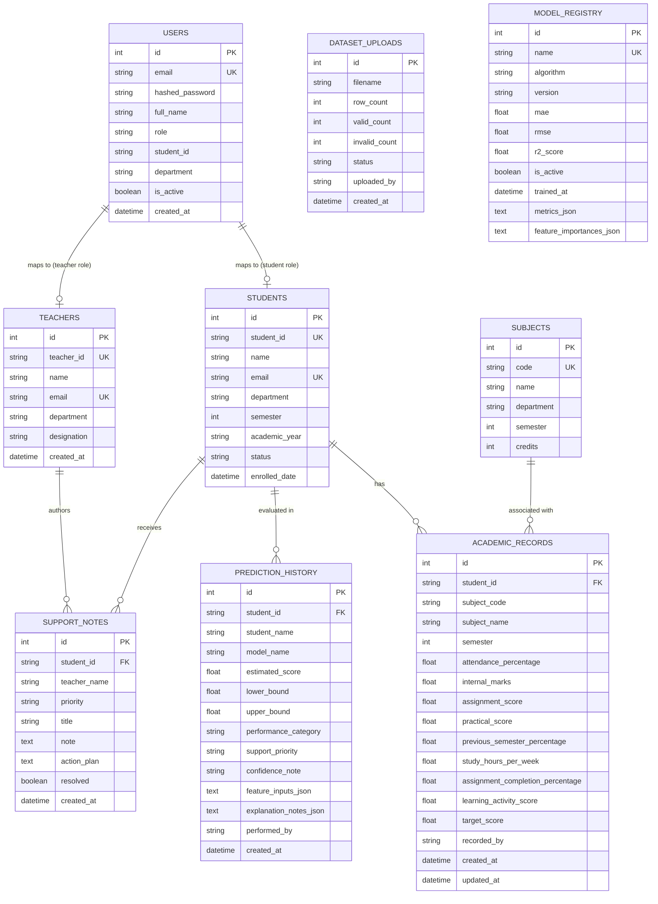

# Database Design & Entity Relationships

## Project Information
- **Project Title:** Students Performance Estimation System Using AI
- **Project Owner:** Nithyasri S
- **Academic Degree Demonstration:** MCA / B.Sc. Computer Science / Information Technology

---

## 1. Entity-Relationship (ER) Diagram

---

## 2. Table Schemas & Constraints

### 2.1 `users`
| Column | Type | Constraints | Description |
| :--- | :--- | :--- | :--- |
| `id` | Integer | PK, Auto Increment | User internal ID |
| `email` | String(255) | Unique, Index, Not Null | Login identifier |
| `hashed_password` | String(255) | Not Null | Salted BCrypt password hash |
| `full_name` | String(255) | Not Null | Display name |
| `role` | String(50) | Not Null | `'admin'`, `'teacher'`, `'student'` |
| `student_id` | String(50) | Nullable, Index | Linked student registration ID |
| `department` | String(100) | Nullable | Academic department |

### 2.2 `students`
| Column | Type | Constraints | Description |
| :--- | :--- | :--- | :--- |
| `id` | Integer | PK, Auto Increment | Student internal ID |
| `student_id` | String(50) | Unique, Index, Not Null | Official university roll number (e.g., STU1001) |
| `name` | String(255) | Not Null | Full legal student name |
| `email` | String(255) | Unique, Index, Not Null | Institutional email |
| `department` | String(100) | Not Null | Department / Degree program |
| `semester` | Integer | Not Null | Current semester (1 to 8) |
| `academic_year` | String(50) | Not Null | Academic calendar period |

### 2.3 `academic_records`
Continuous multi-dimensional evaluation parameters recorded per subject:
- `attendance_percentage`: Classroom presence [0.0, 100.0]
- `internal_marks`: Continuous assessment marks [0.0, 100.0]
- `assignment_score`: Homework quality [0.0, 100.0]
- `practical_score`: Laboratory performance [0.0, 100.0]
- `study_hours_per_week`: Weekly self-study hours [0.0, 80.0]
- `target_score`: Recorded final semester exam score (if completed)
